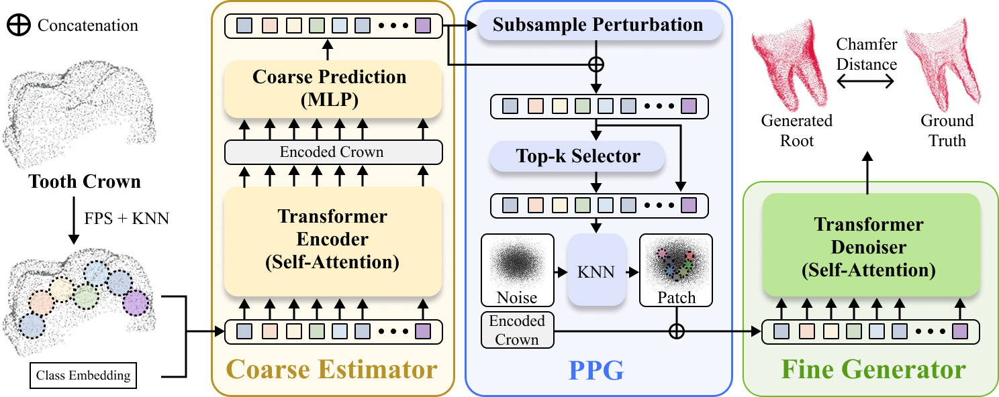

RootCompletion (WACV 2026 — Early Accept)

Official implementation coming soon.  
This repository will contain the code for our WACV 2026 (Early Accept) paper:

“Root Completion from Intraoral Scans using Diffusion with Perturbed Patch Generator (PPG)”

We are cleaning the code and preparing the release.
Please stay tuned!

📬 Contact

For inquiries, please contact: dygks5412@korea.ac.kr
